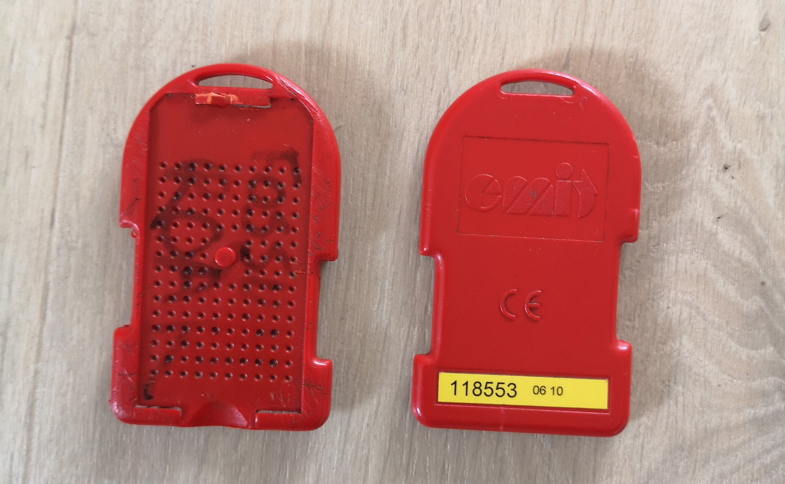
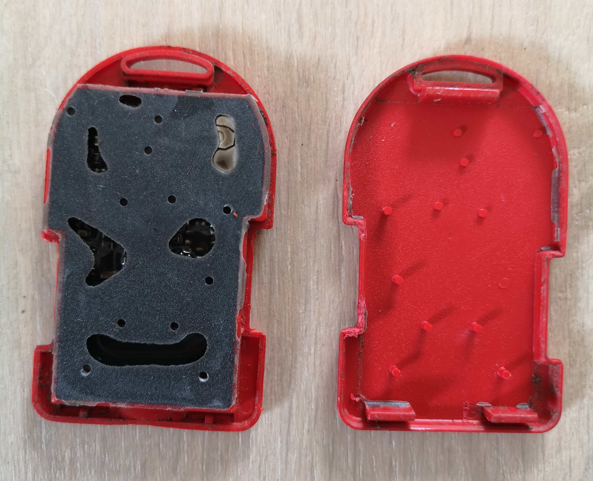
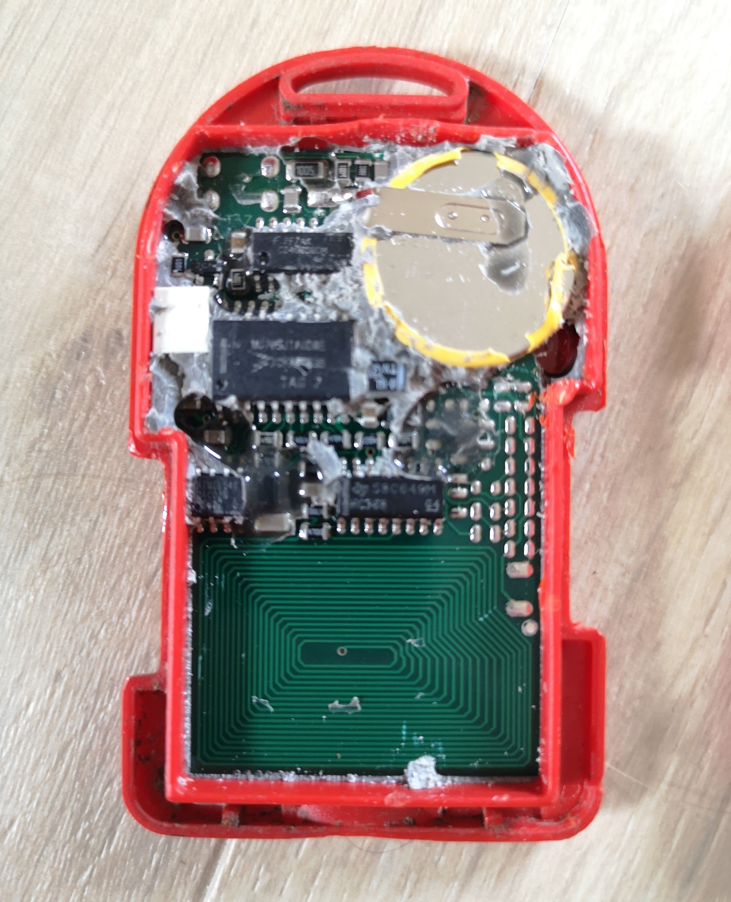
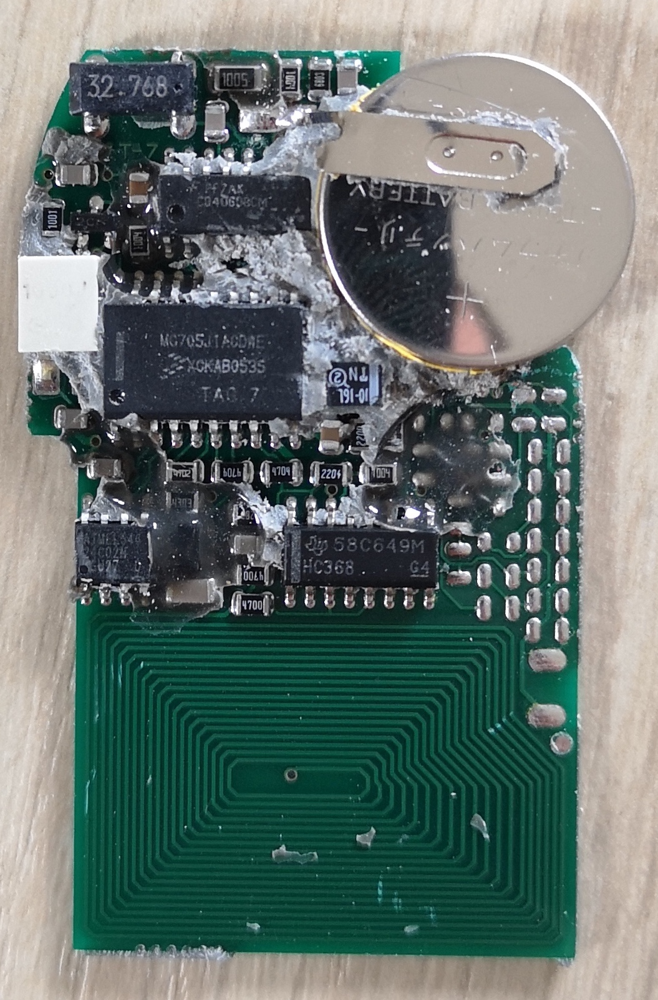
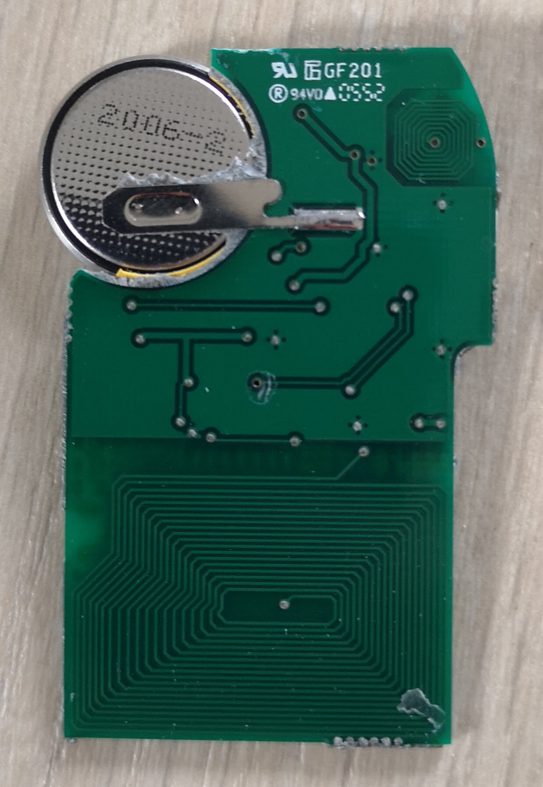
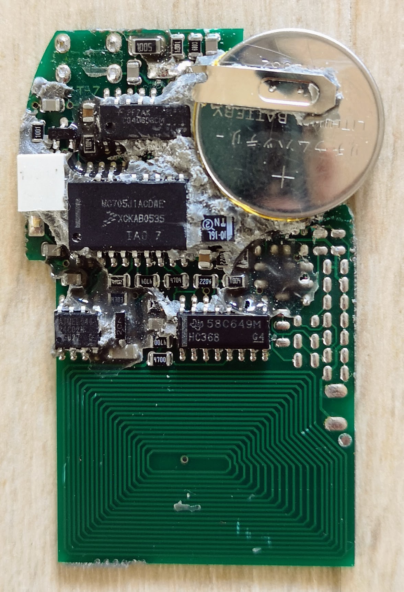
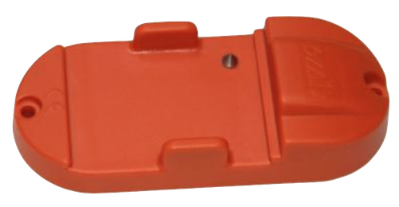

# EMIT e-card information

The [EMIT e-card](https://www.emit.no/en/product/ver5-e-card-389) is used for orienteering races, to register control codes and split times. When punching, the e-card registers the unit's code and running time. The e-card can store up to 50 split times. The split times are stored internal in the e-card until restarted on a starting unit.

The ecard is used with a [control unit](https://emit.no/nettbutikk/emitag/epost/) like this:

The ecard uses a 2032 battery, and here is some of the components:

- Texas Instruments [HC368](./sn74hc368.pdf) (bottom right of circuit board)
- 24C02M, which is an [E2PROM](https://en.wikipedia.org/wiki/EEPROM) (bottom left of curcuit board). Couldn't find the exact component, but you can see many similar here: https://www.qdatasheet.com/search.jsp?sWord=24C02M&op=i
- [MC705J1ACDWE](https://www.newark.com/nxp/mc705j1acdwe/microcontroller-mcu-8-bit-hc05/dp/40K7393?CMP=AFC-SF-FC), a microcontroller (in the middle)
- [CD4060BCM](https://datasheet.octopart.com/CD4060BCM-Fairchild-datasheet-8398761.pdf) 14-Stage Ripple Carry Binary Counters
- 32.768 kHz oscillator

Unindentified components:

- White component to the left of microcontroller.
