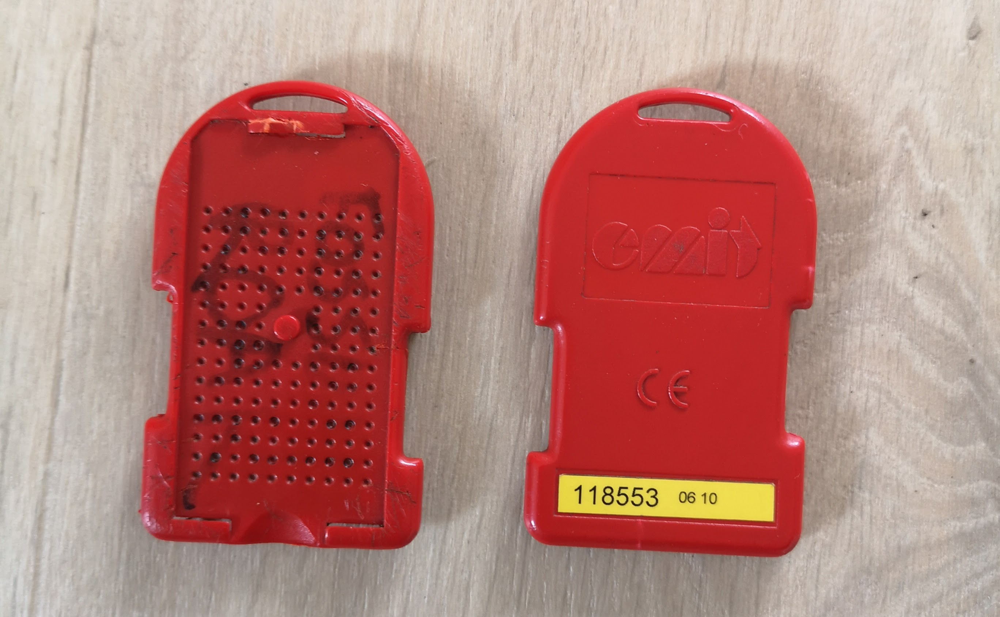
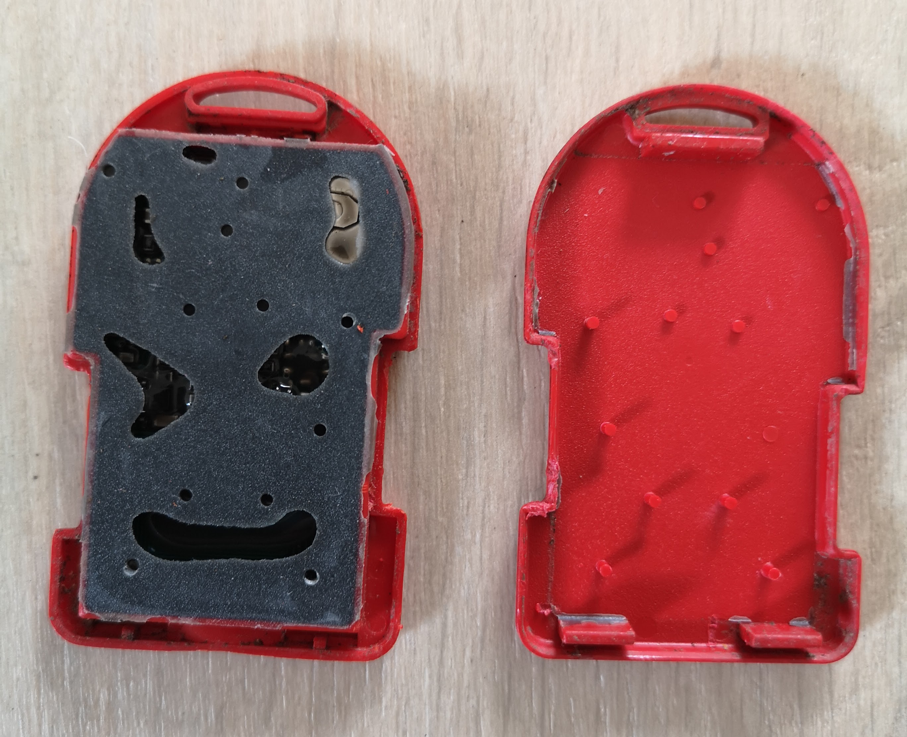
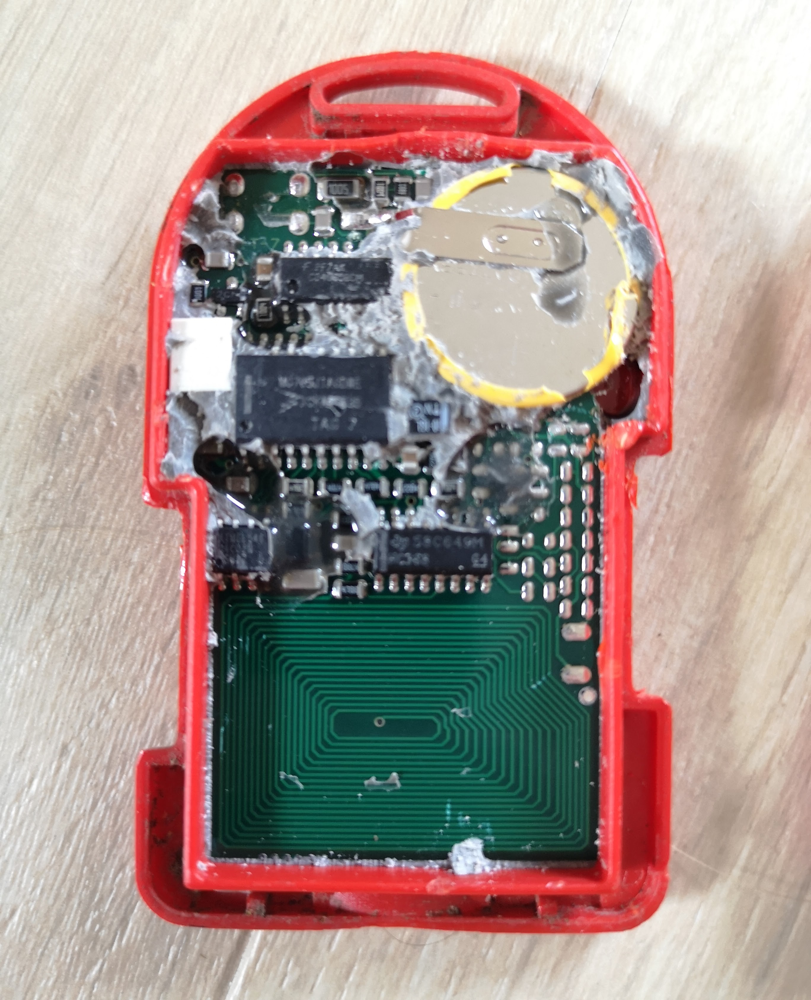
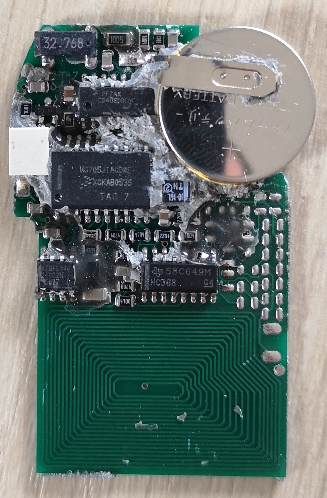
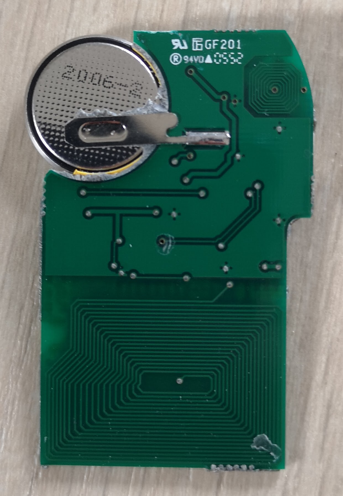
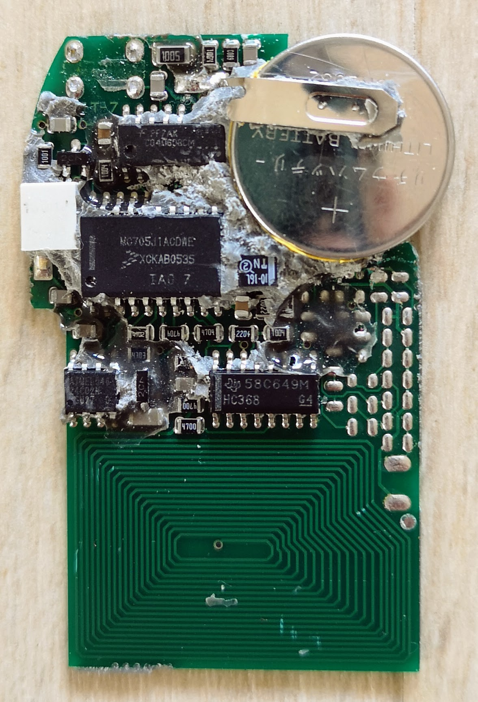

# EMIT e-card information

This repository collects public information and teardown photographs for the EMIT electronic punching card used in orienteering.
Competitors carry the card around a course and punch it at each control to record that they visited the control and the time of the visit.

The exterior photograph shows card identifier `118553`, which is a running card number.
The separate date code `06 10` means that the card was made in June 2010: `06` is the month and `10` is the year.
The repository does not establish which e-card hardware version is pictured.

## Current public information

Emit currently sells [Ver.5](https://emit.no/en/nettbutikk/loperbrikke-ver-5/) and [Ver.7](https://emit.no/en/nettbutikk/loperbrikke-ver-7/) e-cards.
Emit describes Ver.7 as its newest e-card and says that it replaces Ver.6.
The linked product pages say that both versions store up to 50 times until reset at a start unit.

The product photographs and descriptions do not establish that the board pictured in this repository is electrically identical to either current product.

## Teardown photographs

## Research notes

- [Confirmed markings and datasheets](./docs/components.md) records only text that can be read from the photographs.
- [Public documents](./docs/public-documents.md) collects official product and reader information.
